# 两手硬口碑计划-天河店

 

## 土巴兔店铺宝

::: tip 重要性

在土巴兔平台，真实评价举足轻重。评价不仅建立业主信任，还促进服务质量的不断提升，提升两手硬装饰在平台上的竞争力。评价系统透明呈现了服务内容，协助未装修的业主做出明智的选择。同时，评价还能够使得两手硬装饰脱颖而出，进入口碑榜单，促进签单转化率的增长。

:::

::: tip 评价要求

目前店铺宝在前端未开放评价入口，只有土巴兔派单签约客户、购买土巴兔质保服务的客户才可以评价。

- **文字**

建议发布15字以上，可以从服务态度、工程质量、工程进度等多方面入手

- **图片**

建议发布3张图以上，根据阶段选择大空间图，避免脏乱差的画面
:::

::: details 评价教程

1、登入土巴兔签约账户，并且选择我的，

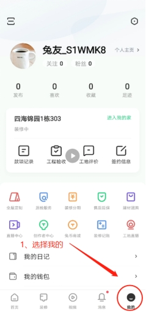 

 

2、找到工程验收，并点击进去

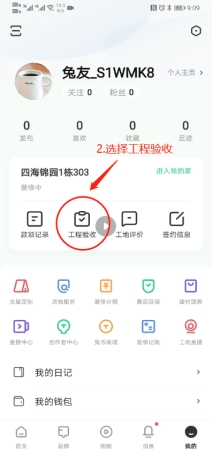 

3、选择对应的阶段进行评价

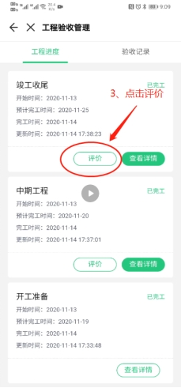 

4、全部点击五星，并输入15字以上的评价

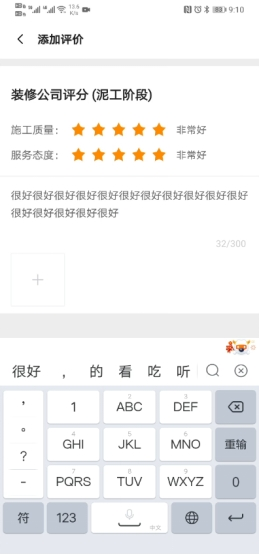 

:::

 

## 美团点评

::: tip 重要性

很多情况下，其他渠道或者上门客户都会去看商户在大众点评的评价，从而决定是否选择这个商家，而且评价的积累影响到店铺的星级，星级越高，客户的信任度就越高，转化率也随之越好；反之，若出现差评，影响的不但是大众点评这个平台转化，还会殃及到其他渠道来源的客户转化。所以需要大家一起来维护好评价，服务上做好每一个细节，获取客户的好评，提升全渠道的转化。

:::

 **门店目标**

天河店：每周1条

::: tip 评价要求

- 文字

建议发布30字以上，可以从设计师的服务好、专业角度写；或者项目经理的手艺不错、施工工期准时去写；以及公司规模大、大牌材料等角度去写

- 图片

建议发布三张以上图片，可以是整洁的施工环境、完工图、公司门店图、展厅图

:::

 

::: details 评价教程

1、打开大众点评app，在首页找到家居、装修板块，点击进去

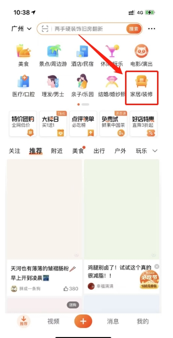 

2、点击装修公司板块，进去页面

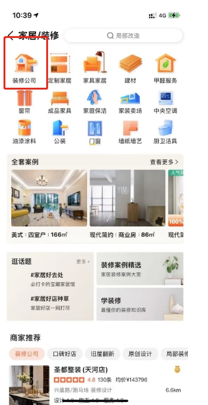 

3、找到我们门店，两手硬装饰旧房改造（天河旗舰店），点击进去浏览几分钟，随便点击几下，（可以咨询几句，或者点击预约量房），若留了客资，提前告知一下运营，否则客户会电话联系该客资

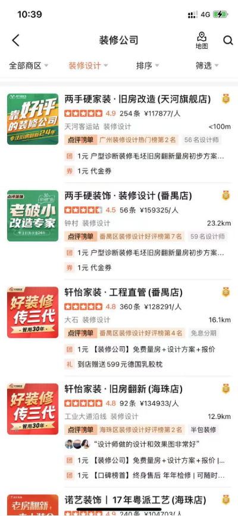 

4、点击左下方的写评价，签约业主选择已签约，未签约业主选择未签约

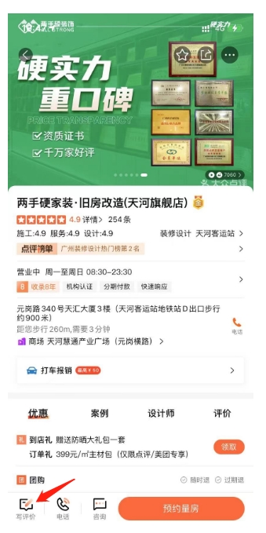 

5、根据前面的内容要求填入

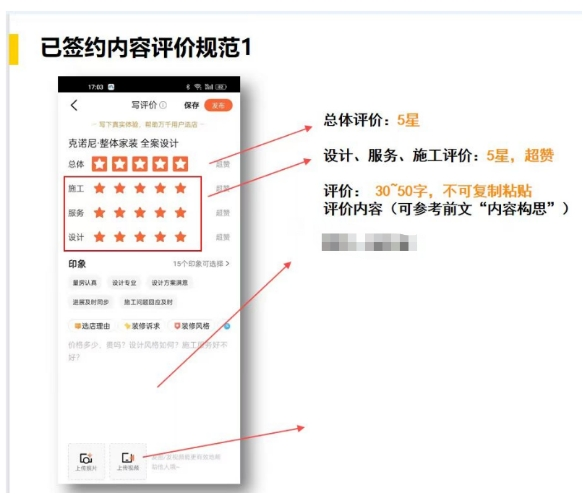 

6、选择对应的设计师、项目经理、若是选择已签约，需要填入消费凭证（合同照）

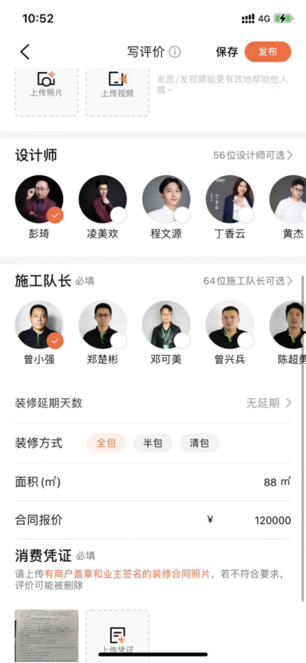 

7、合同照示例：可以让业主拍合同这一页，如下，一定不能有任何遮挡，包括身份证以及其他信息，合同仅供平台审核，不会展示出来，任何人也看不到的，无需担心泄露信息。

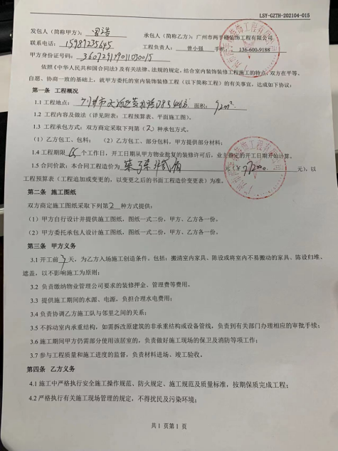 

8、最后，提交即可

:::

## 小红书

::: tip 重要性

小红书目前是一个流量很大的种草平台，很多女性用户基本当了小红书是一个全能的app，在小红书种草后，了解到合适的公司，就会通过各种渠道来找到与这个公司合作，我们需要跟着趋势走，需要在小红书播种，更多真实的业主去帮我们说好话，推荐我们，无形之中也会获取到不少客源，以及提升转化。反之也有很多人会去小红书拔草，看看在其他渠道了解到的公司在小红书有没有负面。

:::

**门店目标**

天河店：每周1条

::: tip 笔记要求

- **文字**

建议30字以上，越多越好，可以以签约，开工仪式，设计师的服务好、专业角度写；或者项目经理的手艺不错、施工工期准时去写；以及公司规模大、大牌材料等角度去写图片。

- **图片**

建议发布一张以上图片，可以是签约合照，开工仪式，验收阶段整洁的施工环境、完工图、公司门店图、展厅图等。
:::

::: details 评价教程

1、打开小红书app，点击下方的+号，进入选择图片页面

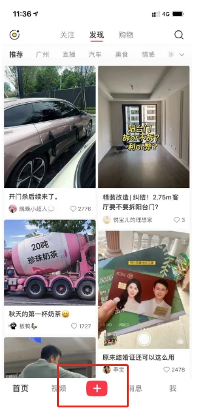 

2、填写好标题以及内容，如下，切记，在内容最后，点击下方圈起来的@用户，@两手硬装饰，这一个一定要记得

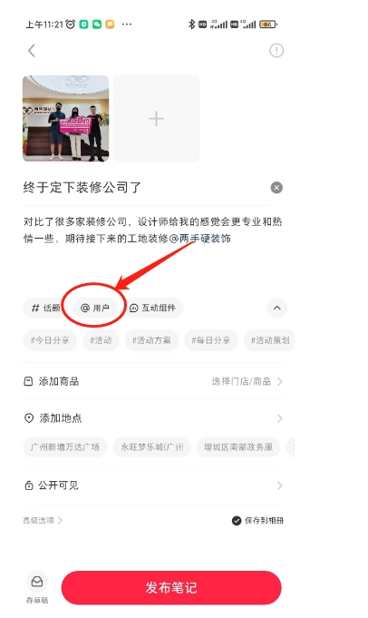 

3、最后发布笔记即可

:::

 

 

 

 